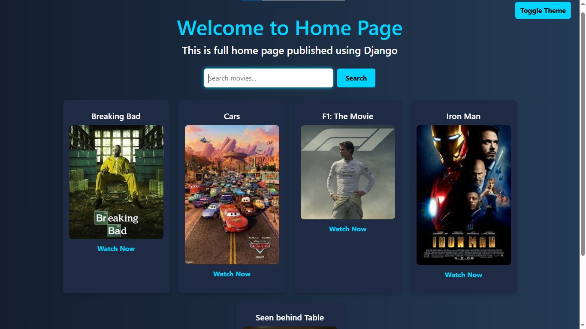

# 🎬 Movie Web App using Django

This is a movie listing web application built with Django. It displays movie posters, allows users to search for movies, and includes a dark/light theme toggle feature.



## 🚀 Features

- Movie grid with posters and titles
- Search bar to find movies
- "Watch Now" links for each movie
- Theme toggle (Light/Dark mode)
- Styled using HTML, CSS (Bootstrap or Tailwind suggested)

---

## 🛠️ Tech Stack

- Python 3.x
- Django
- HTML/CSS (custom or with Bootstrap/Tailwind)

---

## 🏗️ Project Setup

### 1. Clone the Repository

```bash
git clone https://github.com/your-username/movie-django-app.git
cd movie-django-app
```

### 2. Create a Virtual Environment

```bash
python -m venv venv
source venv/bin/activate    # On Windows: venv\Scripts\activate
```

### 3. Install Dependencies

```bash
pip install django
```

### 4. Start Django Project & App

```bash
django-admin startproject movie
cd movie
python manage.py startapp mApp
```

### 5. Apply Migrations

```bash
python manage.py migrate
```

### 6. if env is not able activate

```bash
Set-ExecutionPolicy -Scope Process -ExecutionPolicy Bypass
```

> 📌 If you make changes to `models.py`:
```bash
python manage.py makemigrations
python manage.py migrate
```

---

## 👨‍💻 Run the Server

```bash
python manage.py runserver
```

Then go to [http://127.0.0.1:8000](http://127.0.0.1:8000) in your browser.

---

## 🖼️ Folder Structure

```
movie/
├── mApp/
│   ├── migrations/
│   ├── static/
│   │   └── mApp/
│   │       └── styles.css
│   ├── templates/
│   │   └── mApp/
│   │       └── home.html
│   ├── models.py
│   ├── views.py
│   ├── urls.py
│   └── ...
├── movie/
│   ├── settings.py
│   ├── urls.py
│   └── ...
└── manage.py
```

---

## 📸 Screenshot

Included `django-romil.jpg` shows a sample of the home page UI.

---

## ✍️ Author

Developed by Romil.

---

## 📄 License

This project is licensed under the MIT License - see the [LICENSE](LICENSE) file for details.
